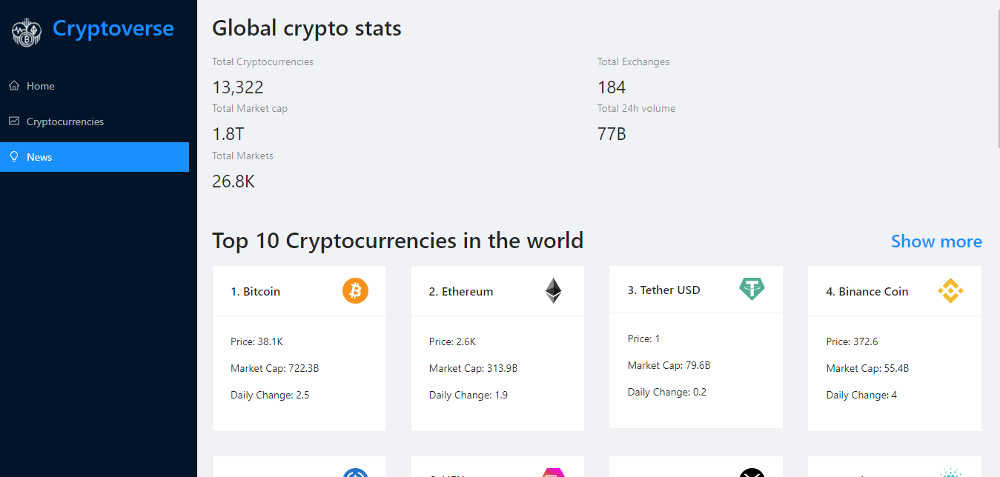
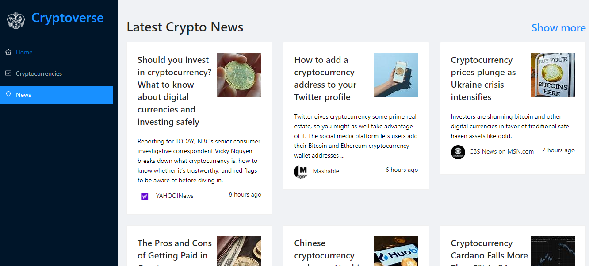
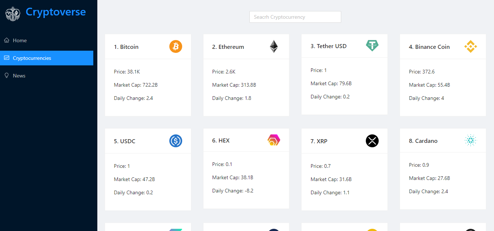
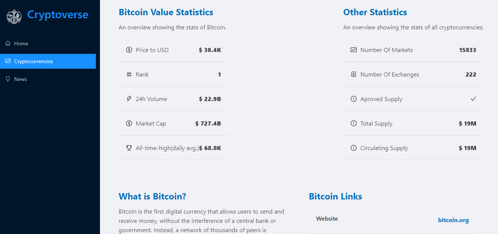
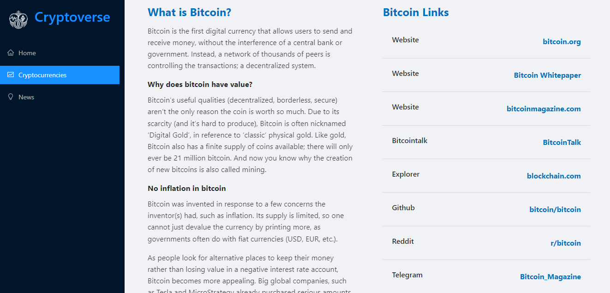
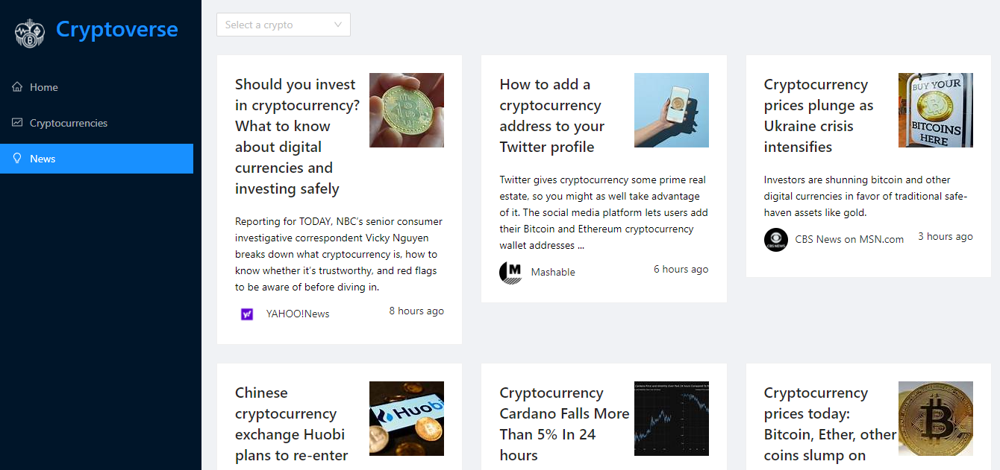

# Cryptoverse app

This project is a enviroment where you can search, look and learn info you need to know about cryptos.

It is divided in 3 parts and a detail page where you can read the info about one specific crypto currency.

## Homepage

This page contains a brief look to the other site pages and has global statistics about cryptos.

## Cryptocurrencies

This page contains the top 100 cryptocurrencies and you can click on each one to look more details about it.

## Crypto Details

Once you click on one crypto you get redirected to this page to read the info about that crypto.

## News

The news page contains several articles you can read and filter this ones with the crypto news you want to look.

However if you want to take a look to the real site, it is deployed here [cryptoverse](https://lfcecryptoverse.netlify.app).